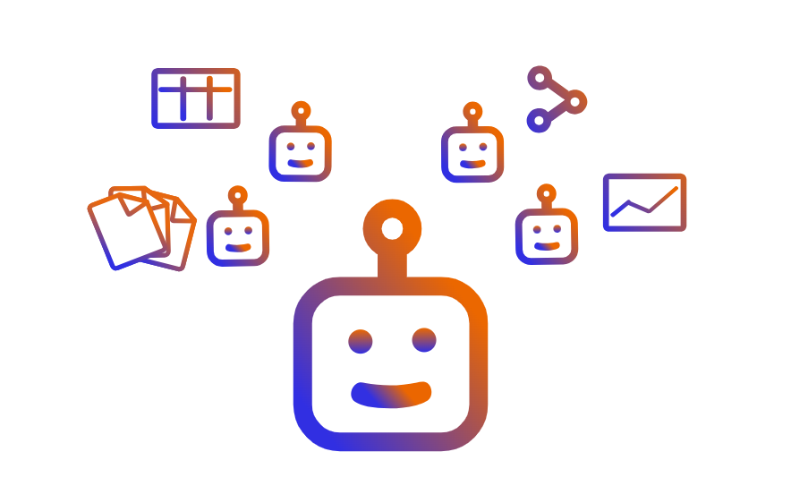
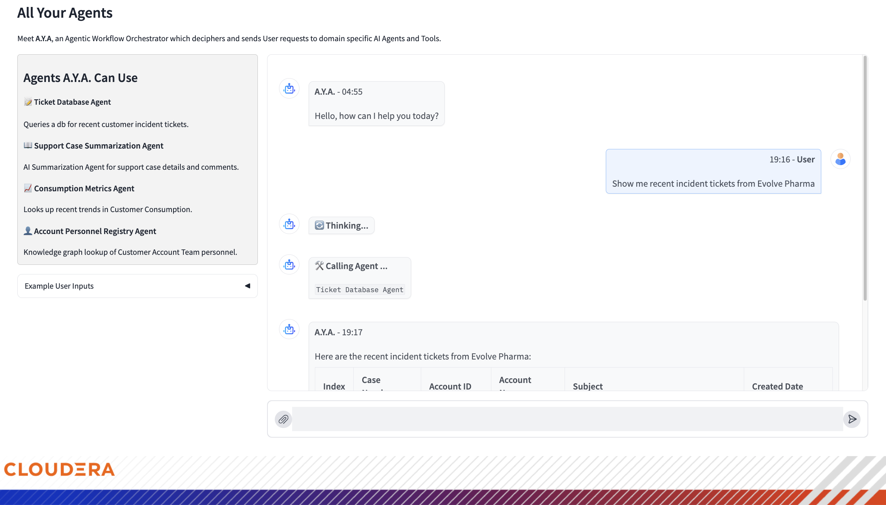

# A.Y.A. - All Your Agents


IMPORTANT: Please read the following before proceeding.  This Community AMP is a third party software package that is not validated or maintained by Cloudera, Inc. ("Cloudera"). By configuring and launching this Community AMP, you will cause such third party software to be downloaded and installed into your environment direct from third party repositories.

If you do not wish to download and install the third party software packages, do not configure, launch or otherwise use this Community AMP.  By configuring, launching or otherwise using the Community AMP, you acknowledge the foregoing statement and agree that Cloudera is not responsible or liable in any way for the third party software packages.

Copyright (c) 2024 - Cloudera, Inc. All rights reserved.

## About this AMP
This AMP implements A.Y.A., an agentic workflow assistant, to demonstrate how agentic workflows can help you interact with a wide and complex series of AI agents and tools.

### Empowering User Workflows
By integrating multiple agents into a single agentic application, users can spend less time looking for the right tools and more time discovering insights and making actionable decisions.

### Taking Advantage of Domain Advances
As domain data tools mature and gain more advanced AI capabilties, so too does an application like AYA. AYA gains the capabilities and power of each agent that has been registered. Each Agent application can then focus on improving and providing deeper capabilities instead of worrying about general purpose tasks that could be handled by other domains.

### AYA Application



**Interface**

The AYA chat interface is built using
- Gradio for UI
- Crew AI for agentic workflow orchestration
- AWS Bedrock for Primary AYA Agent LLM inference
    - Default: anthropic.claude-3-sonnet

**Under the Hood**

To build AYAs responses to User requests, we use [CrewAI](https://github.com/crewAIInc/crewAI), a framework which helps to organize and launch agentic workflows.

The CrewAI libraries give us a a convenient way to describe all the critical parts of AYA
- The primary AYA Agent
- AYA's primary task goals
- All the agent applications AYA can use

These descriptions are put together and presented to the LLM backing AYA to determine the right course of action for a user request.

### Sample Agents
Sample agents have been pre-built and included here for AYA to use. These agents use and provide insights on a variety of data types using a variety of techniques.
Each also represents an Agent capability that could be readily improved via Generative AI techniques and Domain Specific operations

#### [Consumption Metrics Agent](sample_external_applications/usage_consumption_query_app)

- **Source Data**: CSV table containing sample product consumption time data.
- **Current Agent Capabilities**: Computes weekly consumption changes for all customers.

#### [Ticket Database Agent](sample_external_applications/recent_support_tickets_query_app)
- **Source Data**: CSV table containing Support Ticket metadata for all customers
- **Current Agent Capabilities**: Returns lists of recent support tickets for a customer.

#### [Support Case Summarization Agent](sample_external_applications/case_summarizer_app)
- **Source Data**: Support case history information. Files representing the entirety of a support case, with all comments and status.
- **Current Agent Capabilities**: Returns a AI generated summary of a support case. 

#### [Account Personnel Registry Agent (Coming Soon)](sample_external_applications/accounts_knowledge_graph_app)
- **Source Data**: Knowledge graph of customer account metadata. (Products, Account management personnel, Entitlements)
- **Current Agent Capabilities**: Generates and executes Knowledge Graph Cipher 
queries from natural language queries.

## Using This Demo
Deploy this repository as a Cloudera AI Workspace AMP Project.

### Resource Requirements

### CPU
- CML CPU workloads with resource profiles up to (2 vCPU / 4 GiB Memory) will be provisioned
### CML Runtime
PBJ Workbench - Python 3.10

## Deployment Optionss
### AWS Bedrock
The primary interface application and underlying agent applications use AWS Bedrock for LLM inference calls. Please ensure yor AWS account has access to the selected AWS Bedrock model.
The following envs are required to make those generations:
- `AWS_ACCESS_KEY_ID`
- `AWS_SECRET_ACCESS_KEY`
- `AWS_DEFAULT_REGION`
- `AWS_BEDROCK_MODEL`
  - Default: `anthropic.claude-3-sonnet-20240229-v1:0`

#### Enable AWS IAM permissions for Bedrock

The AWS identity you set here must have sufficient [AWS IAM permissions](https://docs.aws.amazon.com/IAM/latest/UserGuide/access_policies.html) to call the Amazon Bedrock service.

For example, To grant full bedrock access to your identity, you can:

- Open the [AWS IAM Console](https://us-east-1.console.aws.amazon.com/iam/home?#)
- Find your [Role](https://us-east-1.console.aws.amazon.com/iamv2/home?#/roles)
- Select *Add Permissions > Create Inline Policy* to attach new inline permissions, open the *JSON* editor and paste in the below example policy:
```
{
    "Version": "2012-10-17",
    "Statement": [
        {
            "Sid": "BedrockFullAccess",
            "Effect": "Allow",
            "Action": ["bedrock:*"],
            "Resource": "*"
        }
    ]
}
```